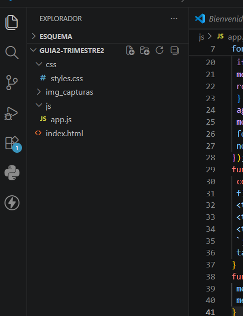
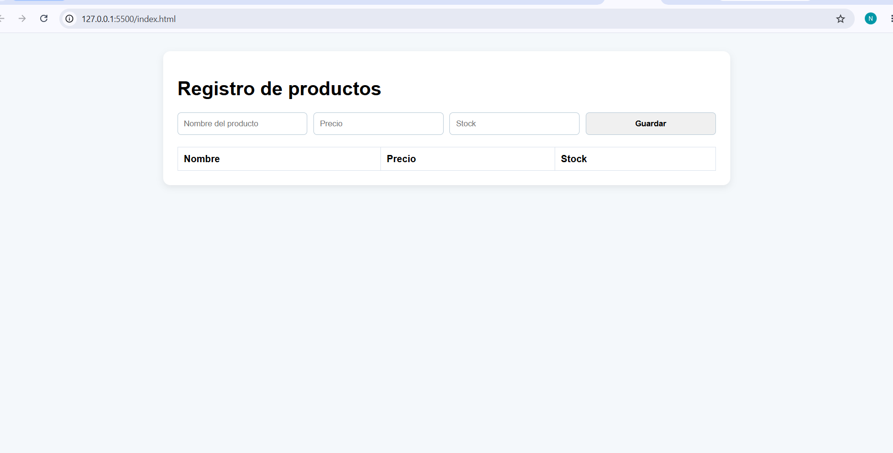
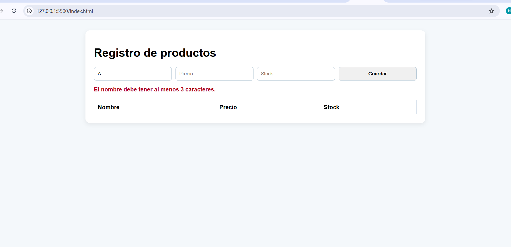
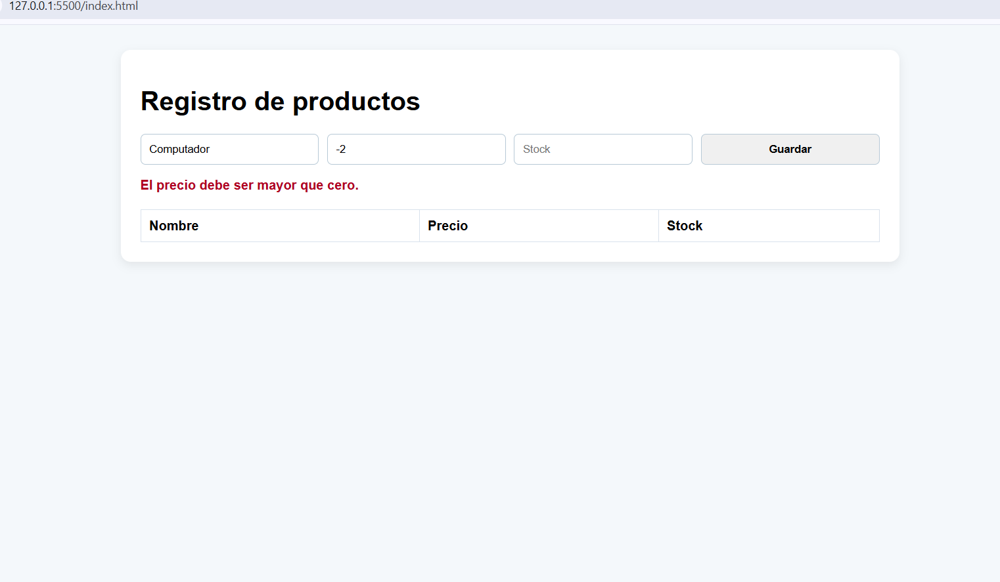
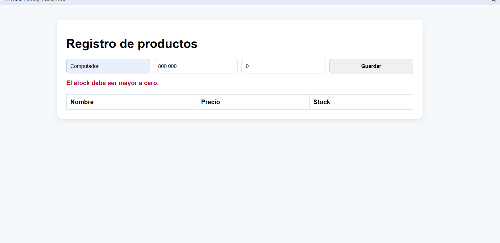
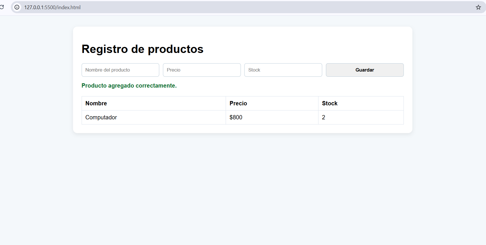
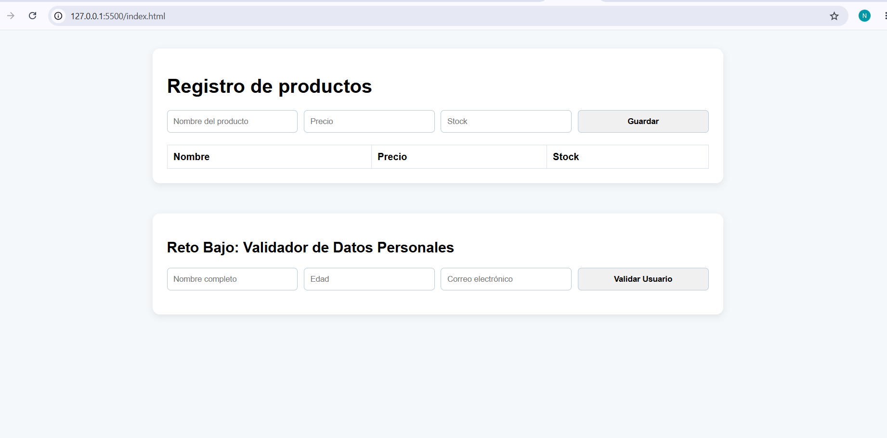
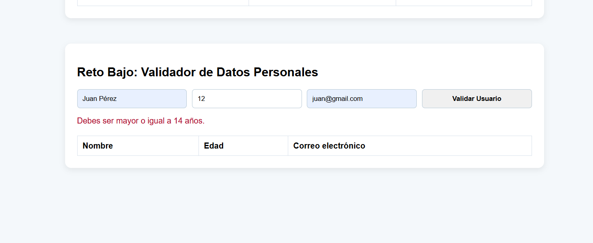
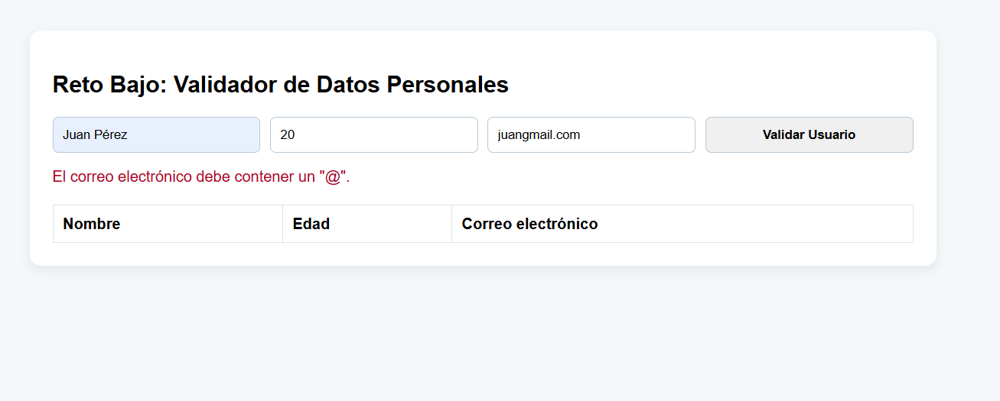
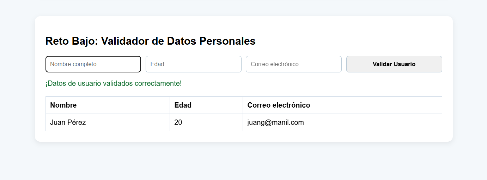

# Evidencias de Desarrollo - Interfaz Dinámica con JavaScript

Este repositorio contiene la entrega de la Guía 2: JavaScript para interfaces dinámicas del SENA, en el programa Análisis y Desarrollo de Software. El proyecto presenta formularios funcionales para la captura de datos, la validación en el navegador y la actualización dinámica de la interfaz mediante JavaScript.

## Descripción general del proyecto

El propósito de este trabajo es mostrar la capacidad de construir interfaces interactivas que evitan errores de usuario y mejoran la experiencia sin recargar la página. Se integran dos módulos: un registro de productos y un validador de datos personales, cada uno con sus propias reglas de validación.

La solución separa claramente la estructura, el estilo y la lógica en archivos independientes: `index.html`, `css/styles.css` y `js/app.js`. Además, el repositorio incluye evidencia visual organizada en `img_capturas` para respaldar el proceso de desarrollo.

## Estructura del proyecto

La organización de carpetas y archivos permite mantener el proyecto limpio y fácil de mantener:

- `index.html`: página principal con los dos formularios y la tabla de resultados.
- `css/styles.css`: estilos para la presentación y el comportamiento adaptable.
- `js/app.js`: funciones de validación, manejo de eventos y manipulación del DOM.
- `img_capturas/`: capturas de pantalla documentando cada caso de uso.

### Estructura de carpetas en el editor

## Registro de productos

Este módulo controla la creación de productos con los campos de nombre, precio y stock. Las validaciones aplicadas son:

- Nombre con al menos 3 caracteres.
- Precio mayor a cero.
- Stock mayor o igual a cero.

### Interfaz estática inicial

### Validación de errores

- Error en campo Nombre cuando el texto no alcanza el tamaño mínimo.
  
- Error en campo Precio cuando el valor es menor o igual a cero.
  
- Error en campo Stock cuando la cantidad es negativa.
  

### Registro exitoso

La adición de un producto válido genera una fila nueva en la tabla mediante creación de nodos DOM, sin recargar la página.

## Validador de datos personales

Este segundo formulario valida la información de un usuario según reglas específicas:

- Nombre obligatorio.
- Edad mínima de 14 años.
- Correo electrónico con carácter `@`.

### Formulario base

### Validaciones específicas

- Restricción de edad: no se acepta menor de 14 años.
  
- Restricción de correo: se verifica que el correo incluya `@`.
  

### Resultado exitoso

Al ingresar datos válidos, el formulario muestra un mensaje de éxito y limpia los campos para un nuevo registro.

## Uso

Para revisar el proyecto, abra `index.html` en un navegador o utilice un servidor local. Interactúe con los dos formularios para comprobar las validaciones y la actualización dinámica de la interfaz.

## Tecnologías utilizadas

- HTML5
- CSS3
- JavaScript

## Observaciones

El proyecto demuestra buenas prácticas de separación de responsabilidades entre la presentación y la lógica, y evidencia la importancia de validar datos en el cliente para prevenir entradas erróneas antes de procesarlas.
